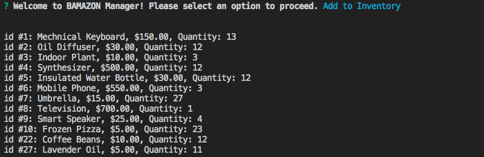

# BAMAZON 🛒
### A Node.js and MySQL Real-Time Storefront

_BAMAZON_ is an Amazon-like storefront built with MySQL and Node.js. The app takes in orders from customers and adds/depletes stock from the store's inventory in the MySQL database. You can also log in as a manager to view inventory, add stock, and add new products.

* To run this app, please clone to your hard disk, navigate to the folder, and run
```npm install```.
* This will install both ```mysql``` and ```inquirer``` packages which make the database and functionality possible.
* You will then need to update the credentials within the js files to connect to your personal database.
* To purchase items, simply run ```node bamazonCustomer```
* To add new products, view inventory, and add additional stock, run ```node bamazonManager```.

Example of the inventory screen from the manager layout: 



For a comprehensive rundown, please [click here](https://drive.google.com/file/d/1b7H_0DPXc5qmNZgUAMocWVzl7yDiekLA/view) to view a full video walkthrough of the app.